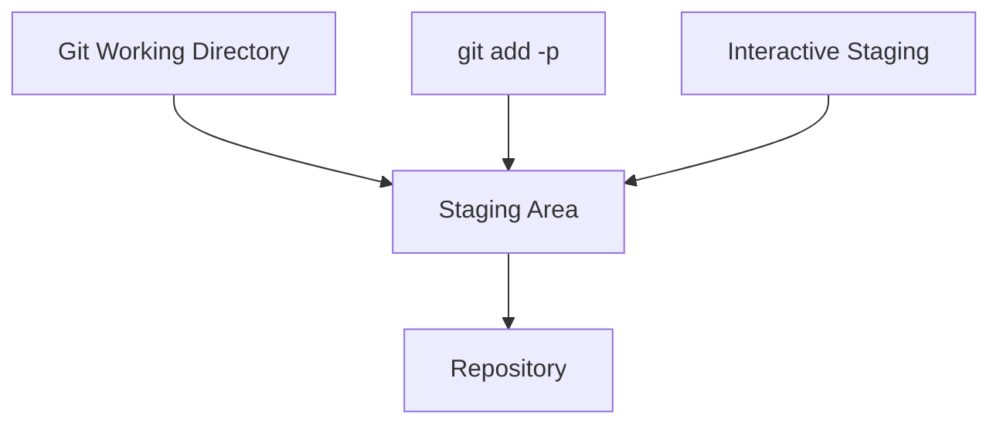
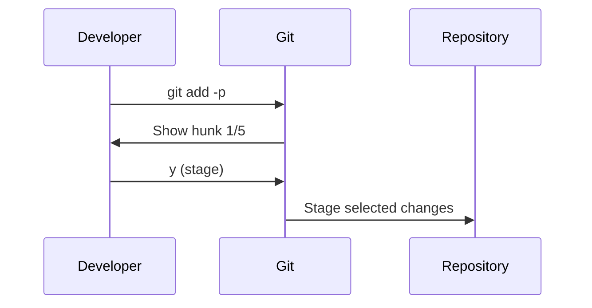
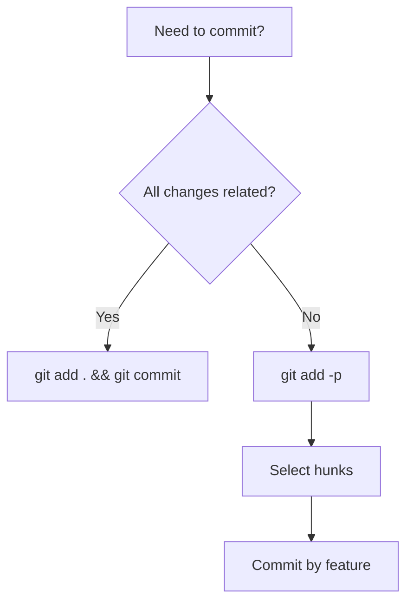

# Blog Content Creation Steering

## AI Content Assistant Features

### 🤖 AI Feedback System

When creating content, AI will automatically:

1. **Content Analysis**
   - Assess if content matches Sandikodev writing style
   - Check technical accuracy and depth
   - Verify problem-solution structure
   - Evaluate code example quality

2. **Enhancement Suggestions**
   - Recommend missing code snippets
   - Suggest visual diagrams
   - Identify opportunities for analogies
   - Propose better technical explanations

### 📊 Mermaid Diagram Generator

AI will offer Mermaid diagrams for:

**System Architecture Topics:**



**Process Flows:**



**Decision Trees:**



### 💻 Code Snippet Intelligence

AI will automatically suggest code snippets for:

**Technical Categories:**

- **System/DevOps**: Bash scripts, Docker configs, CI/CD pipelines
- **Programming**: JavaScript, TypeScript, Python, Go examples
- **Git**: Command sequences, workflow examples
- **Security**: Authentication, encryption, best practices
- **Architecture**: Configuration files, setup guides

**Code Enhancement Features:**

- Syntax highlighting optimization
- Comment explanations
- Error handling examples
- Performance considerations

### 🔤 FiraCode Ligature Support (Coming Soon)

**Frontmatter Toggle:**

```yaml
---
title: "Advanced Git Workflows"
# ... other frontmatter
features:
  firacode_ligatures: true # Enable ligature rendering
  code_theme: "tokyo-night" # Syntax highlighting theme
  diagram_style: "dark" # Mermaid diagram theme
---
```

**Ligature Examples:**

- `!=` → ≠
- `>=` → ≥
- `<=` → ≤
- `=>` → ⇒
- `->` → →
- `<-` → ←
- `===` → ≡
- `!==` → ≢

### 🔄 AI Enhancement Confirmations

AI will ask before adding enhancements:

```
AI: "I detect this is about Git workflows. Should I include:
🔹 Mermaid diagram showing git flow?
🔹 Code snippets for common commands?
🔹 Comparison table of different approaches?
🔹 FiraCode ligatures for better code readability?

Proceed with these enhancements? [Y/n]"
```

### 📋 Enhanced Frontmatter Template

```yaml
---
title: "Engaging Title with Keywords - Specific Benefit"
description: "SEO-optimized meta description (150-160 chars) with clear value proposition"
date: 2025-12-19T15:00:00+07:00
author: "Sandikodev"
category: "Primary Category" # Frontend, DevOps, Git, Vision, Tools
tags: ["specific-tech", "broader-concept", "use-case", "framework"]
image: "/images/blog/descriptive-filename.webp"
draft: false

# AI Enhancement Features
ai_features:
  mermaid_diagrams: true # Auto-generate diagrams
  code_snippets: true # Enhanced code examples
  technical_depth: "advanced" # basic, intermediate, advanced

# Visual Features (Coming Soon)
visual:
  firacode_ligatures: true # Enable programming ligatures
  code_theme: "tokyo-night" # Syntax highlighting theme
  diagram_style: "dark" # Mermaid diagram styling

# Content Assistance
content_type: "technical" # technical, tutorial, opinion, review
auto_toc: true # Generate table of contents
reading_time: true # Calculate reading time
---
```

### 🎯 AI Quality Assurance

Before publishing, AI will confirm:

```
AI: "Content analysis complete:
✅ Matches Sandikodev writing style
✅ Problem-solution structure present
✅ Technical depth appropriate
⚠️  Consider adding more code examples
⚠️  Mermaid diagram would improve understanding

Generate missing elements? [Y/n]"
```

### 🛠️ AI Integration Commands

```bash
# Generate article with AI assistance
/create-article --topic "git-interactive-staging" --level advanced --diagrams true

# Enhance existing content
/enhance-content --file "article.md" --add-diagrams --optimize-code

# Generate Mermaid diagram
/generate-diagram --type flowchart --topic "git-workflow"

# AI content review
/review-content --file "article.md" --check-style --verify-technical
```

---

### Sandikodev Writing Style

- **Technical but Accessible** - Complex concepts explained with analogies
- **Problem-Solution Approach** - Start with real problems, provide practical solutions
- **Code-Heavy Examples** - Extensive practical code snippets and demos
- **Personal Experience** - First-person narrative, lessons learned
- **Visual Learning** - ASCII diagrams, code comparisons, step-by-step guides
- **Passionate Tone** - Enthusiastic about technology and tools
- **Practical Focus** - Actionable insights over theoretical discussions

### Content Categories

| Category     | Focus                    | Examples                         |
| ------------ | ------------------------ | -------------------------------- |
| **Frontend** | Modern frameworks, DX    | Svelte, React, Astro, TypeScript |
| **DevOps**   | Tools, automation        | Git, Docker, CI/CD, Linux        |
| **Git**      | Version control mastery  | Advanced Git, workflows, tools   |
| **Vision**   | Future tech, philosophy  | BCI, R.U.I.N, tech predictions   |
| **Tools**    | Productivity, efficiency | Terminal, tmux, editors          |

## Frontmatter Template

```yaml
---
title: "Engaging Title with Keywords - Specific Benefit"
description: "SEO-optimized meta description (150-160 chars) with clear value proposition"
date: 2025-12-19T15:00:00+07:00
author: "Sandikodev"
category: "Primary Category" # Frontend, DevOps, Git, Vision, Tools
tags: ["specific-tech", "broader-concept", "use-case", "framework"]
image: "/images/blog/descriptive-filename.webp"
draft: false
---
```

### Title Patterns

- **Problem-Solution**: "Git Stash vs Manual Commits: When Interactive Staging Saves the Day"
- **Comparison**: "React vs Svelte: Developer Experience Wars"
- **Guide**: "The Complete Guide to Git Interactive Staging"
- **Tool Focus**: "Tmux: The Ultimate Session Persistence Guide"
- **Philosophy**: "Why the Elephant Theory Applies to Software Development"

### Description Guidelines

- 150-160 characters optimal
- Include primary keyword
- Promise specific value/outcome
- Action-oriented language

## Content Structure

### Opening Hook (Problem Statement)

```markdown
## The Problem: [Relatable Developer Pain Point]

Picture this: You're deep in development, multiple features half-done,
and suddenly you need to commit changes separately. Sound familiar?

**Git interactive staging solves this.** It's like having surgical
precision for your commits instead of a sledgehammer.
```

### Technical Deep Dive

```markdown
## Understanding the Architecture

Before diving into commands, let's understand the concept:
```

WORKING DIRECTORY
├── Modified files (unstaged)
├── Staged changes (ready to commit)
└── Committed history (permanent)

````

### Visual Comparisons
```markdown
## Traditional Approach vs Modern Solution

**❌ Old Way:**
```bash
# Commit everything at once
git add .
git commit -m "fix stuff"
````

**✅ Better Way:**

```bash
# Selective staging
git add -p
# Choose exactly what to commit
```

### Practical Examples

- Real-world scenarios
- Step-by-step commands
- Expected outputs
- Common pitfalls and solutions

### Conclusion with Actionable Takeaways

```markdown
## Key Takeaways

1. **Use interactive staging** for complex commits
2. **Split large changes** into logical chunks
3. **Practice the workflow** until it becomes natural

**Next Steps:**

- Try `git add -p` on your current project
- Experiment with different hunk operations
- Share your experience in the comments
```

## Content Tone Guidelines

### Voice Characteristics

- **Conversational** - "Let's dive into...", "Here's the thing..."
- **Confident** - Strong opinions backed by experience
- **Helpful** - Focus on solving real problems
- **Enthusiastic** - Genuine excitement about good tools
- **Honest** - Acknowledge limitations and trade-offs

### Language Patterns

- **Questions**: "Ever wondered why...?", "What if I told you...?"
- **Analogies**: "It's like having...", "Think of it as..."
- **Emphasis**: "This is **crucial**", "Here's the **key insight**"
- **Transitions**: "But here's where it gets interesting...", "Now, let's see..."

## Technical Writing Standards

### Code Blocks

````markdown
```bash
# Always include comments
git add -p  # Interactive staging
```
````

```javascript
// Explain complex logic
const result = complexFunction(data);
// This handles edge cases for...
```

### Diagrams and Visuals

```markdown
## Git Workflow Visualization
```

BEFORE:
Working Dir → Staging → Repository
↓ ↓ ↓
Mixed Nothing Big Commit

AFTER:
Working Dir → Staging → Repository  
 ↓ ↓ ↓
Clean Selective Atomic Commits

```

### Error Handling
- Always show common errors
- Provide troubleshooting steps
- Include "what if" scenarios

## SEO Optimization

### Keyword Strategy
- **Primary**: Main topic (e.g., "git interactive staging")
- **Secondary**: Related terms (e.g., "git add -p", "selective commits")
- **Long-tail**: Specific problems (e.g., "how to commit partial changes git")

### Internal Linking
- Link to related posts
- Reference previous articles
- Create content clusters

### External Authority
- Link to official documentation
- Reference industry experts
- Cite reliable sources

## Content Calendar Themes

### Monthly Focus Areas
- **January**: New Year, New Tools
- **February**: Performance & Optimization
- **March**: Spring Cleaning (Refactoring)
- **April**: Framework Comparisons
- **May**: Developer Productivity
- **June**: Mid-year Tech Review
- **July**: Summer Learning Projects
- **August**: Back-to-Basics
- **September**: Advanced Techniques
- **October**: Automation & DevOps
- **November**: Year-end Reflections
- **December**: Future Predictions

## Quality Checklist

### Before Publishing
- [ ] Title is compelling and keyword-rich
- [ ] Description is 150-160 characters
- [ ] Code examples are tested and working
- [ ] All links are functional
- [ ] Images are optimized (WebP format)
- [ ] Grammar and spelling checked
- [ ] Technical accuracy verified
- [ ] Frontmatter is complete
- [ ] Tags are relevant and specific
- [ ] Category matches content focus

### Post-Publishing
- [ ] Social media promotion
- [ ] Monitor for comments/feedback
- [ ] Update internal links from other posts
- [ ] Track performance metrics
- [ ] Plan follow-up content if needed

## Content Ideas Bank

### Git Series
- "Git Interactive Staging: The Developer's Scalpel"
- "Git Stash vs Squash: When to Use Each"
- "The Elephant Theory in Software Development"
- "Git Hunk Operations: Beyond y/n"

### Developer Experience
- "Why Kiro CLI Changed My Development Workflow"
- "Terminal vs GUI: The Productivity Debate"
- "The Art of Commit Messages"

### Framework Deep Dives
- "Svelte 5 Runes: The Reactivity Revolution"
- "Astro Islands: The Future of Partial Hydration"
- "React vs Vue vs Svelte: 2025 Developer Experience"

### Philosophy & Vision
- "The Enterprise Elephant: Why Big Companies Move Slowly"
- "Building for the Brain-Computer Interface Era"
- "The Death of Traditional Desktop Computing"
```
